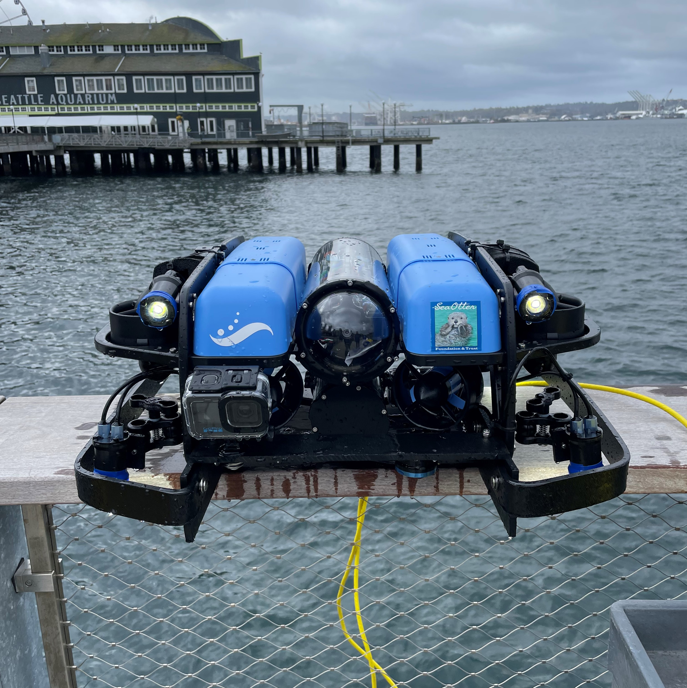
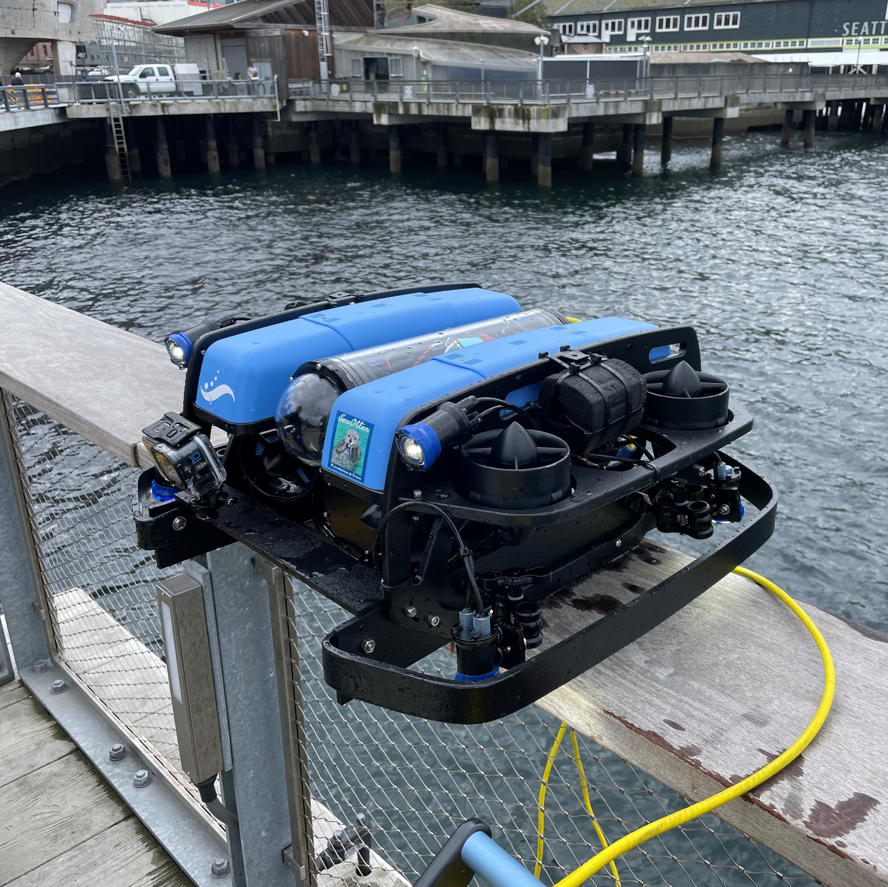
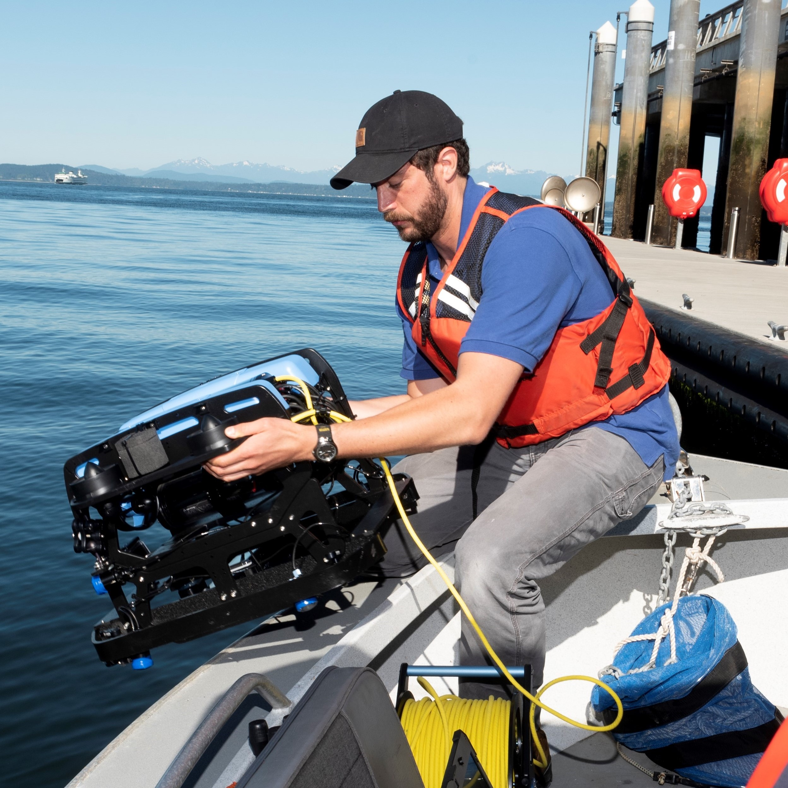
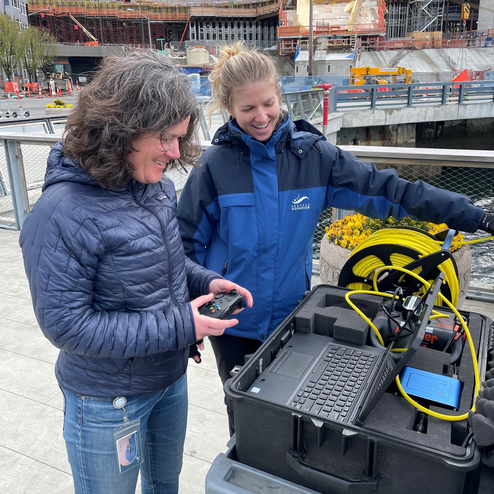
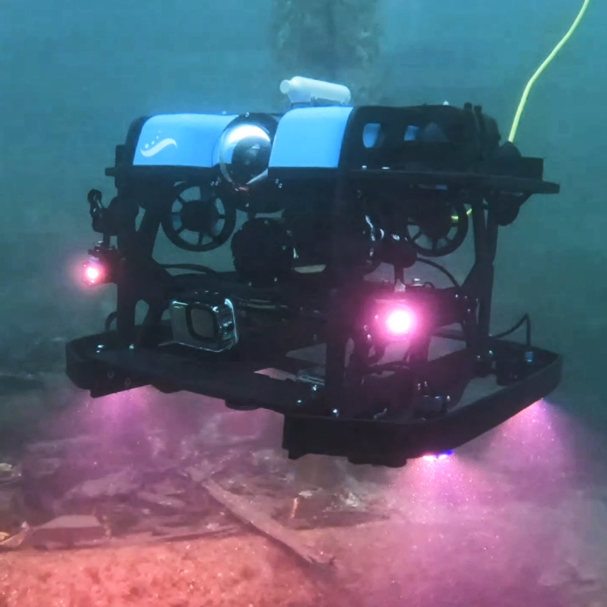
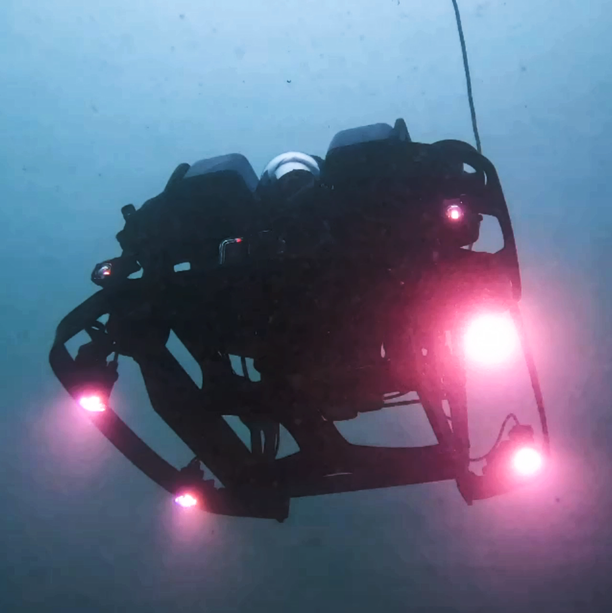

# Seattle_Aquarium_ROV_development
This is a public repository to organize information and documents pertaining to the customization, testing, and deployment of the Seattle Aquarium's two BlueROV2's, dubbed ROV *Nereo* & and ROV *Lutris*. As part of the Coastal Complexity & Resilience project run by Conservation Programs & Partnerships (CPP), we have developed and tested standardized protocols to use a small, relatively inexpensive, and readily deployable ROV to conduct photo/video surveys along relatively shallow seafloor (5-40m depth), especially along canopy-forming and understory kelp forest locations. Our mission is to expand the spatial extent across which we gather data and make inferences about benthic community structure, stability, and resilience. We are not seeking to replace scientific SCUBA diving-based monitoring, but rather envision using ROVs as an additional tool alongside divers that will complement and enhance existing long-term subtidal monitoring programs. The purpose of this repository is to make information as accessible as possible to our partners, collaborators, and the public. 

If you desire to "get into the weeds" in terms of code, analyses, and the management of the various sensor/data streams from the ROV, see our other public repository [Seattle_Aquarium_ROV_telemetry_imagery_analysis](https://github.com/zhrandell/Seattle_Aquarium_ROV_telemetry_imagery_analysis)

## Core resources 
* To view videos from the ROV, see the _ROV_video_vignettes_ document ([here](https://github.com/zhrandell/Seattle_Aquarium_ROV_development/blob/main/ROV_videos.md))
* To view photos of the ROV and from its deployment, see [this](https://drive.google.com/drive/folders/1f--MS3UWWd0GPid-CwgvD2KQ-q4D7zgT?usp=sharing) Google Drive folder
* To view all hardware and software associated with this project, see the _hardware_software_ document ([here](https://github.com/zhrandell/Seattle_Aquarium_ROV_development/blob/main/documents/hardware_software.md))

## Public facing
* To view a Seattle Channel video detailing our partnership with Port of Seattle, see [this link](https://www.youtube.com/watch?app=desktop&v=WdsnsdwxIYs)
* To view a January 2023 talk at the Puget Sound Kelp Research and Monitoring Workgroup, see [this link](https://www.youtube.com/watch?v=weyHmOVaXjk&t=5935s)
* To read a press release regarding our partnership with the Port of Seattle, see [this website](https://www.portseattle.org/news/port-seattle-and-seattle-aquarium-collaborate-restore-kelp-forests-elliott-bay)
* To read a Seattle Aquarium blog post about our research, see [this link](https://www.seattleaquarium.org/blog/ai-goes-below-surface-using-technology-make-difference-local-kelp)
* To view a Xbox Twitch Stream event, view [this link](https://www.twitch.tv/xbox/video/1800600515) starting at 22:00.  
* To read a post detailing our research on the BlueRobotics forums, see [this link](https://discuss.bluerobotics.com/t/new-research-using-customized-bluerov2-to-conduct-kelp-forest-surveys/13166)
* To read an article in the Wahkiakum County Eagle about our ROV outreach and engagement, see [this link](https://www.waheagle.com/story/2022/12/08/wahkiakum-people/seattle-aquarium-gives-career-talk-and-demo-at-town-pool/21681.html)
* To view an interview with Diane Tomecek, CEO and President of Sea Otter Foundation and Trust, see [this link](https://www.youtube.com/watch?v=KDEc3Q2V5XQ)
* To view a November 2021 talk at the Puget Sound Kelp Research and Monitoring Workgroup, see [this link](https://www.youtube.com/watch?v=q3xT6H-Ufks&t=1702s)

## Synopses
* To read our 2022 year-end report to the Port of Seattle, download the pdf found at [this link](https://drive.google.com/file/d/1HJUBRQQiuhMxuoTgmrHuluVSnRD-cZ3M/view?usp=share_link)
* To read our August 2022 mid-year report to the Port of Seattle, download the pdf found at [this link](https://drive.google.com/file/d/1TKmW6_uTrDJhU3D5V1hLlYneD5uOjDOW/view?usp=share_link)
* To read an early (April 2022) report on preliminary ROV testing and AI proof-of-concept analyses, download the pdf at [this link](https://drive.google.com/file/d/1WJlOQx8s-SBERnd90mW8A6-63SzD9MGU/view?usp=share_link)

## Funding proposals
* To read a proposal funded by the North Pacific Coast Marine Resources Committee, see _North_Pacific_Coast_MRC_proposal_ document ([pdf](https://github.com/zhrandell/Seattle_Aquarium_ROV_development/blob/main/documents/North_Pacific_Coast_MRC_proposal/ROV_pilotStudy_NPC-MRC_proposal%2021-23.pdf)) 
* To read a proposal funded by Sea Otter Foundation and Trust, see the _SOFT_2022_SeattleAquarium_proposal_ document ([pdf](https://github.com/zhrandell/Seattle_Aquarium_ROV_development/blob/main/documents/SOFT_2022_SeattleAquarium_proposal.pdf))

  
  
 

 
 
 

  
   

 

  
   

We welcome collaborators and partners, as well as feedback, comments, and questions. Please direct contact to z.randell@seattleaquarium.org

