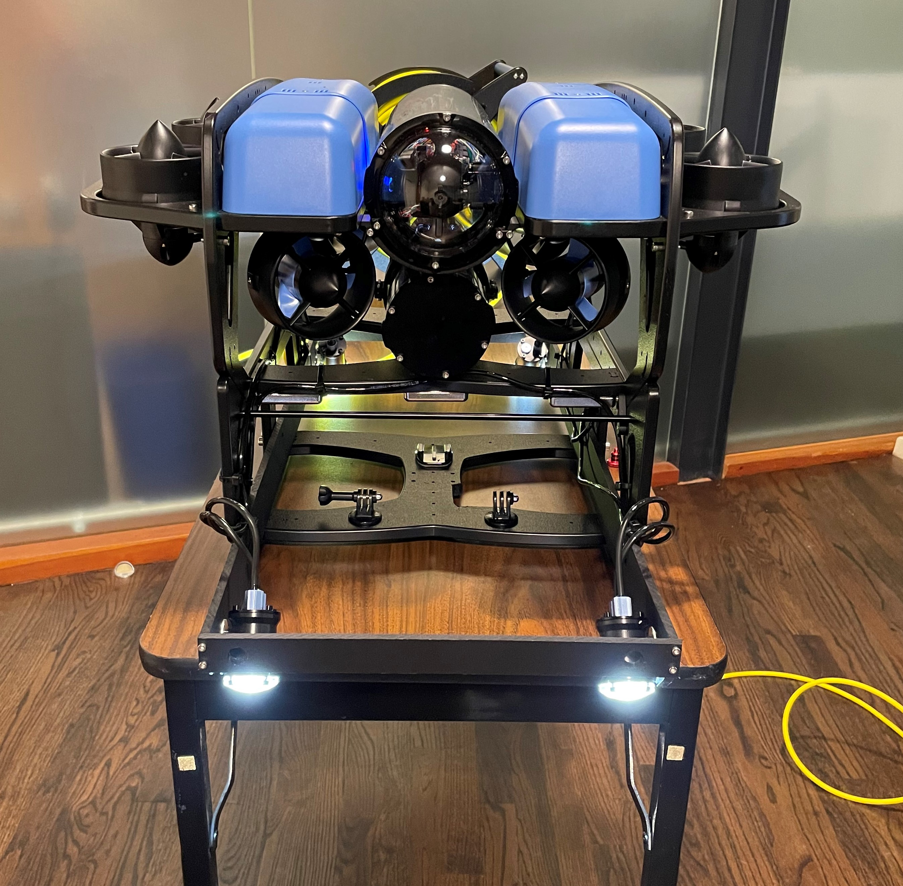

# Seattle_Aquarium_ROV_development
This is a public repository to organize information and documents pertaining to the development and testing of the Seattle Aquarium's BlueROV2, _Waksa·s_, a Makah word for octopus. 

  
  
  

