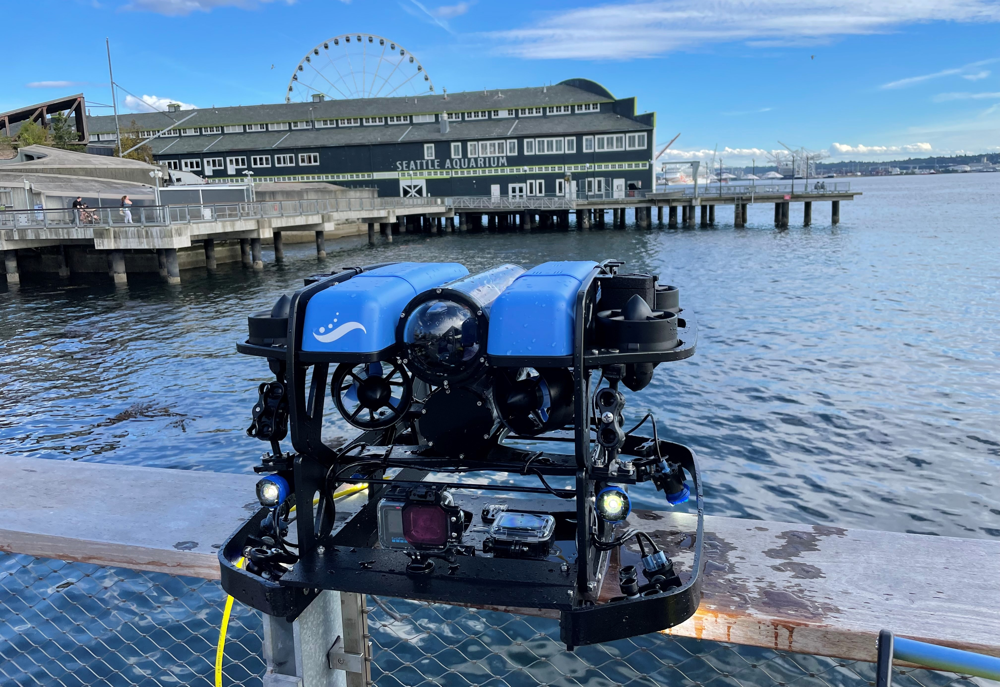
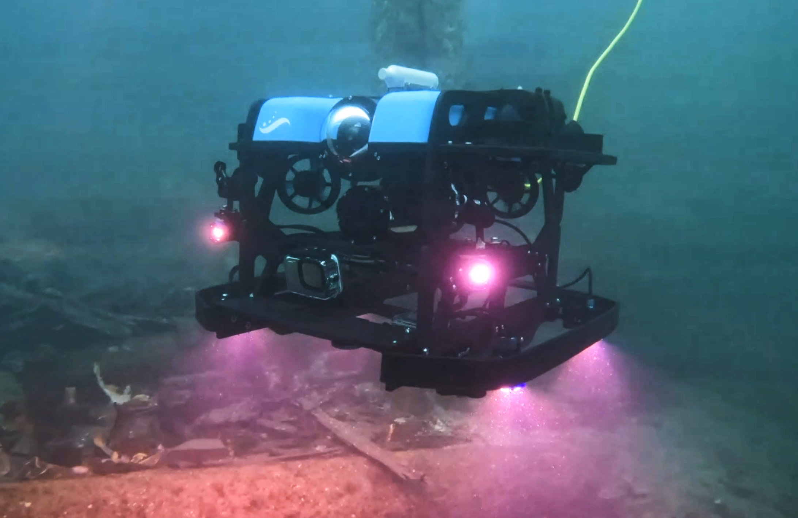
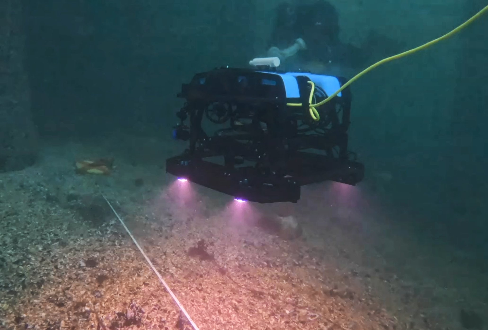
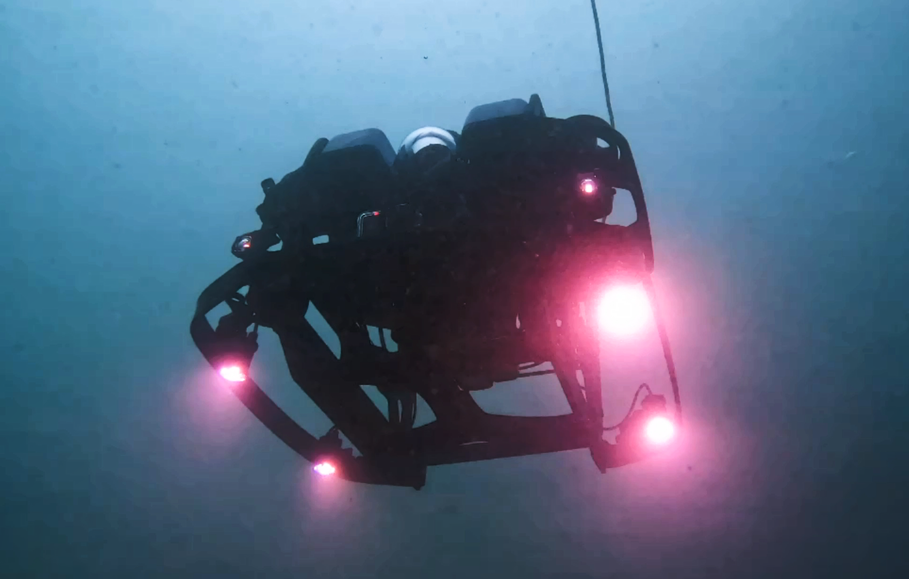

# Seattle_Aquarium_ROV_development
This is a public repository to organize information and documents pertaining to the customization, testing, and deployment of the Seattle Aquarium's BlueROV2, dubbed ROV *Nereo*. As part of the Coastal Complexity & Resilience project run by Conservation Programs & Partnerships (CPP), we have develped and tested standardized protocols to use a small, relatively inexpensive, and readily deployable ROV to conduct photo/video surveys along relatively shallow seafloor (5-30m depth), especially along canopy-forming and understory kelp forest locations. Our mission is to expand the spatial extent across which we gather data and make inferences about benthic community structure, stability, and resilience. We are not seeking to replace scientific SCUBA diving-based monitoring, but rather we envision using ROVs as an additional tool alongside divers that will complement and enhance existing long-term subtidal monitoring programs. The purpose of this reposity is to make information as accessible as possible to our partners, collaborators, and the public. 

If you desire to "get into the weeds" in terms of code, analyses, and the management of the various sensor/data streams from the ROV, see our other public repository [Seattle_Aquarium_ROV_telemetry_imagery_analysis](https://github.com/zhrandell/Seattle_Aquarium_ROV_telemetry_imagery_analysis)

* To view videos from the ROV, see the _ROV_video_vignettes_ document ([here](https://github.com/zhrandell/Seattle_Aquarium_ROV_development/blob/main/ROV_videos.md))
* To view photos of the ROV and from its deployment, see [this](https://drive.google.com/drive/folders/1f--MS3UWWd0GPid-CwgvD2KQ-q4D7zgT?usp=sharing) Google Drive folder
* To view all hardware and software associated with this project, see the _hardware_software_ document ([here](https://github.com/zhrandell/Seattle_Aquarium_ROV_development/blob/main/documents/hardware_software.md))
* To read a press release detailing the collaboration between the Port of Seattle and the Seattle Aquarium, see [this website](https://www.portseattle.org/news/port-seattle-and-seattle-aquarium-collaborate-restore-kelp-forests-elliott-bay)
* To view an interview with Diane Tomecek, CEO and President of Sea Otter Foundation and Trust, who generously funded the purchase of our ROV, see [this video](https://www.youtube.com/watch?v=KDEc3Q2V5XQ)
* To view a presentation about our (at the time) proposed project at the November 2021 Puget Sound Kelp Research and Monitoring Work Group, see [this video](https://www.youtube.com/watch?v=q3xT6H-Ufks&t=1702s)
* To read a synopsis of ROV testing and AI proof-of-concept analyses of benthic imagery, see the _ROV_AI_synopsis_ document ([TeX](https://github.com/zhrandell/Seattle_Aquarium_ROV_development/blob/main/documents/ROV_AI_synopsis/ROV_AI_synopsis.tex), [pdf](https://github.com/zhrandell/Seattle_Aquarium_ROV_development/blob/main/documents/ROV_AI_synopsis/ROV_AI_synopsis.pdf)) (the pdf is a large file and requires being downloaded)
* To read a proposal funded by the North Pacific Coast Marine Resources Committee, see _North_Pacific_Coast_MRC_proposal_ document ([pdf](https://github.com/zhrandell/Seattle_Aquarium_ROV_development/blob/main/documents/North_Pacific_Coast_MRC_proposal/ROV_pilotStudy_NPC-MRC_proposal%2021-23.pdf)) 
* To read a proposal funded by Sea Otter Foundation and Trust, see the _SOFT_2022_SeattleAquarium_proposal_ document ([pdf](https://github.com/zhrandell/Seattle_Aquarium_ROV_development/blob/main/documents/SOFT_2022_SeattleAquarium_proposal.pdf))

  
  
 

 
 
 

  
   

We welcome collaborators and partners, as well as feedback, comments, and questions. Please direct contact to z.randell@seattleaquarium.org
