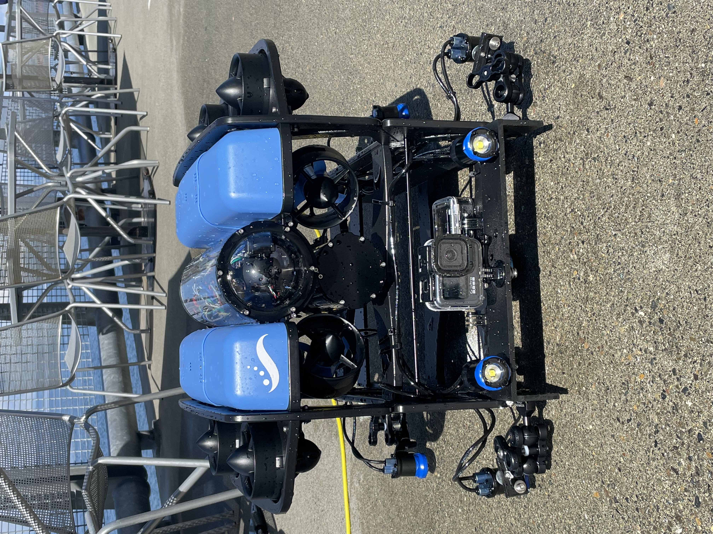
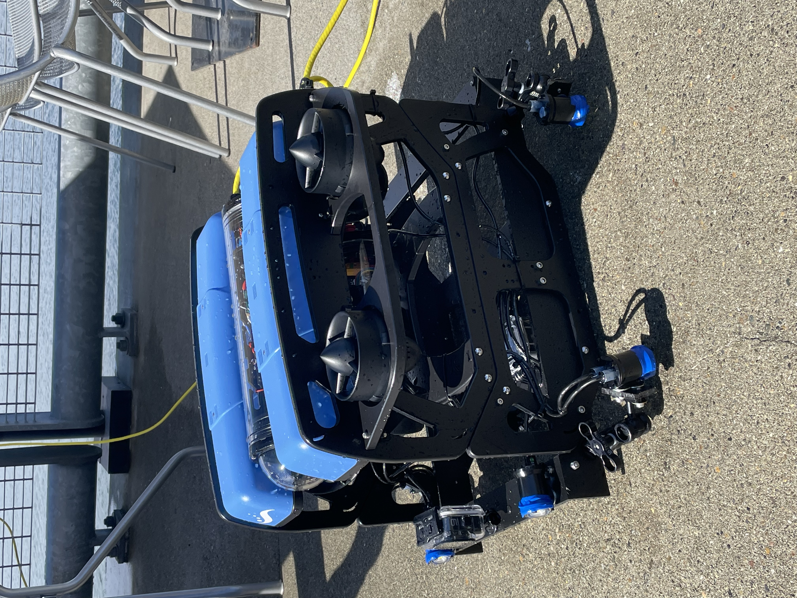

# Seattle_Aquarium_ROV_development
This is a public repository to organize information and documents pertaining to the development and testing of the Seattle Aquarium's BlueROV2.

Our objective is to develop methods of using a small, relatively inexpensive, and readily deployable ROV to conduct photo/video surveys along shallow (5-40m) regions of the seafloor. This includes surveying urchin-barrens and locations characterized by understory/turf algae as well as canopy-forming kelp forests. The latter environment in particular will undoutebly pose challenges, but even a partial success surveying canopy kelp forests would radically expand the spatial extent across which we gather data and make inferences about benthic community structure. We are not seeking to replace scientific SCUBA diving-based monitoring, but rather we envision using ROVs as an additional tool that will operate alongside divers as part of long-term subtidal monitoring programs. 

  
  

* To read a press release detailing the collaboration between the Port of Seattle and the Seattle Aquarium, see [this website](https://www.portseattle.org/news/port-seattle-and-seattle-aquarium-collaborate-restore-kelp-forests-elliott-bay)
* To read a summary of our motivation and methods, see the _project_summary_ document ([TeX](https://github.com/zhrandell/Seattle_Aquarium_ROV_development/blob/main/documents/project_summary/CCR_summary_document.tex), [pdf](https://github.com/zhrandell/Seattle_Aquarium_ROV_development/blob/main/documents/project_summary/CCR_summary_document.pdf))
* To read a synopsis of ROV testing and AI proof-of-concept analyses of benthic imagery, see the _ROV_AI_synopsis_ document ([TeX](https://github.com/zhrandell/Seattle_Aquarium_ROV_development/blob/main/documents/ROV_AI_synopsis/ROV_AI_synopsis.tex), [pdf](https://github.com/zhrandell/Seattle_Aquarium_ROV_development/blob/main/documents/ROV_AI_synopsis/ROV_AI_synopsis.pdf)) (the pdf is a large file and requires being downloaded)
* To read a proposal funded by the North Pacific Coast Marine Resources Committee, see _North_Pacific_Coast_MRC_proposal_ document ([pdf](https://github.com/zhrandell/Seattle_Aquarium_ROV_development/blob/main/documents/North_Pacific_Coast_MRC_proposal/ROV_pilotStudy_NPC-MRC_proposal%2021-23.pdf)) 
* To view all hardware and software associated with this project, see the _hardware_software_ document ([markdown](https://github.com/zhrandell/Seattle_Aquarium_ROV_development/blob/main/documents/hardware_software.md))
* To view videos from the ROV, see the _ROV_video_vinettes_ document ([markdown](https://github.com/zhrandell/Seattle_Aquarium_ROV_development/blob/main/documents/ROV_videos.md))

As what we envision is ambitious, we welcome collaborators and partners, as well as feedback, comments, and questions. If you want to contact Prinicpal Investigator Dr. Zachary Randell, he can be reached at: z.randell@seattleaquarium.org 

